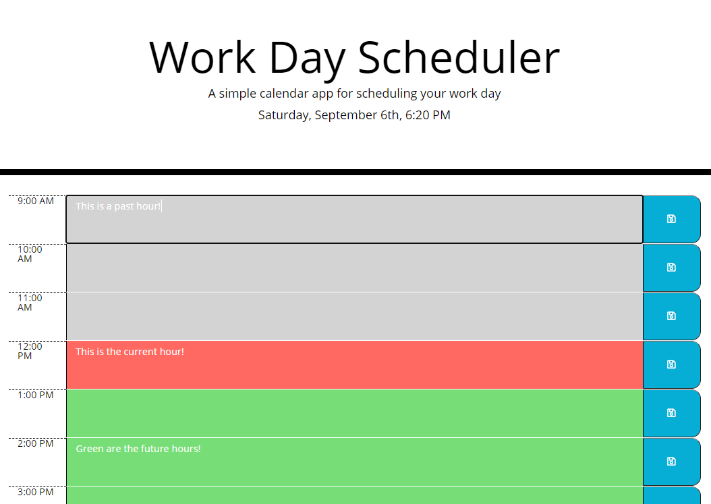

# Daily-Task-Planner

;

## Demo 
(https://samisully.github.io/Daily-Task-Planner/)

## Description 

A single page javascript and jquery page that allows you to record tasks based on each hour. It generates the tinkeblocks dynamically and updates based on the hour in order to mark past events in one color, highlight the current hour, and have the future events in another color for easier readability.

## Installation

Install the files directly through the github and they are ready to go!

## Usage

Free useage!

## Credits

© Sami Sully

Lots of help gained from Georgia Tech full time bootcamp class students and instructors

And lots of help from the resources:

www.w3schools.com

https://developer.mozilla.org/en-US/docs/Web/JavaScript